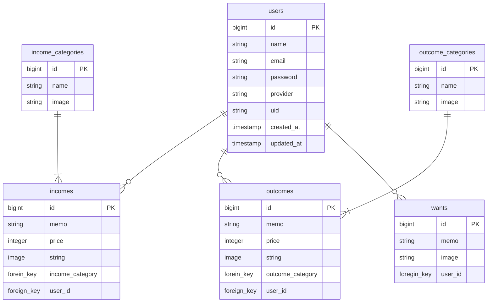

```mermaid

erDiagram

users ||--o{  incomes : ""
users ||--o{  outcomes : ""
users ||--o{  wants : ""
income_categories ||--|{  incomes : ""
outcome_categories ||--|{  outcomes : ""

users {
    bigint id PK
    string name
    string email
    string password
    string provider
    string uid
    timestamp created_at
    timestamp updated_at
  }
  incomes {
    bigint id PK
    string memo
    integer price
    image string
    forein_key income_category
    foreign_key user_id
  }

  outcomes {
    bigint id PK
    string memo
    integer price
    image string
    forein_key outcome_category
    foreign_key user_id
  }

  wants {
    bigint id PK
    string memo
    string image
    foregin_key user_id
  }

  income_categories {
    bigint id PK
    string name
    string image
  }

  outcome_categories {
     bigint id PK
     string name
     string image
  }


```