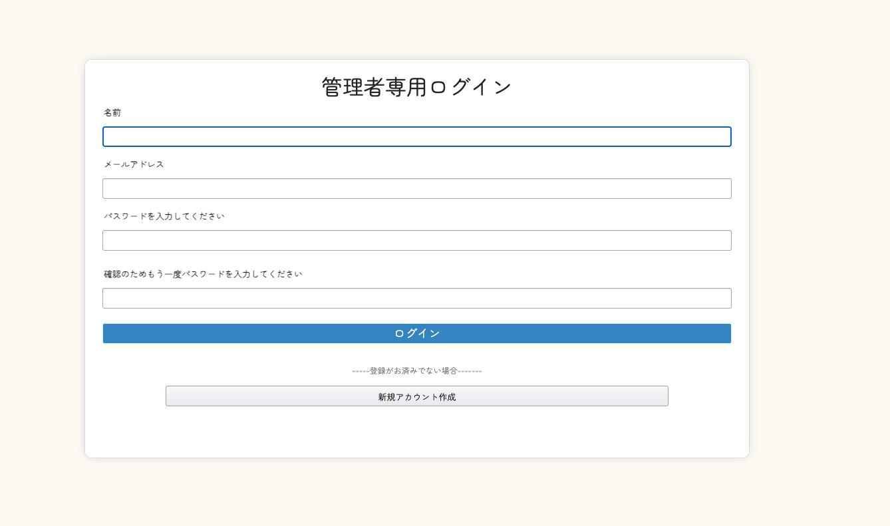
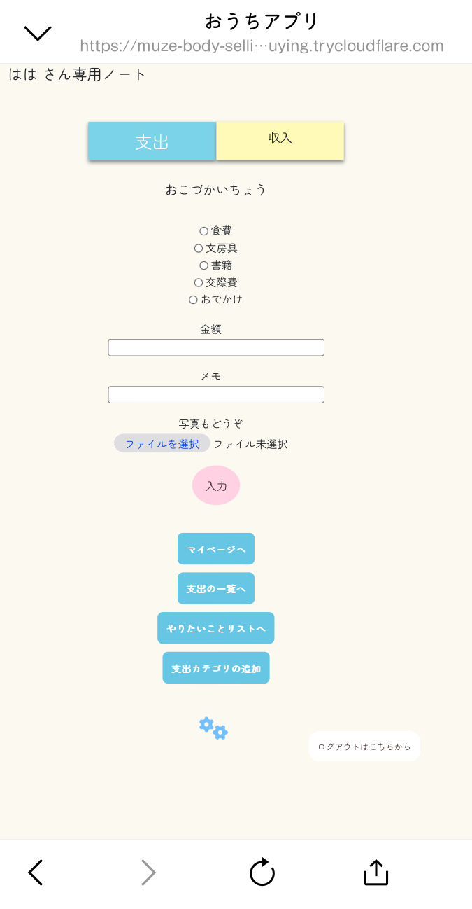

# README

## アプリの概要および想定ユーザー
子供向けの「おこづかいちょう」アプリです。  
スマホを使用することが増えたため、手軽に管理できるように制作しました。  

## なぜこのアプリを作成するのか
お金の持ち方について考える  
必要経費、好きなこと、人のために使うお金と分けて予算を立てる感覚を身につける  
自分のお金の使い道や今後の目標を記録することで、好きなこと、興味あることを可視化する  
やりたいことを計画し、そのための予算を立てる  

以上について考えるきっかけになればと思い、作成しました。  

## 使用技術
* Ruby version  2.7.3
* Rails version 5.2.4.2
* 開発環境 sqlite3
* 本番環境 mySQL2

## 機能一覧
・ユーザーアカウントをLINEログイン機能(devise使用)  
・管理者アカウントはメールで登録(devise使用)  
・収入、支出の登録（金額、メモ、写真）、編集、削除、一覧表示  
・マイページで月ごと、年ごとの集計を表示  
・ユーザー名を編集可能  
・カテゴリ名を追加可能  
・管理者画面では登録ユーザー名と最終ログイン日時を表示  
・予算を入力するカラムは未実装  

## 画面について

## 工夫したところ
①Webアプリですがスマホで使用することを想定し、画面を構成  
②タブ切り替えで直感的に入力しやすいよう作成  
③配色にはベースをクリーム色、クリックは青色、戻るボタンはピンク色をベースに作成  
④ユーザーと管理者はUserモデルにroleカラムを追加することで実装  

## 最後まで読んでいただき、ありがとうございました